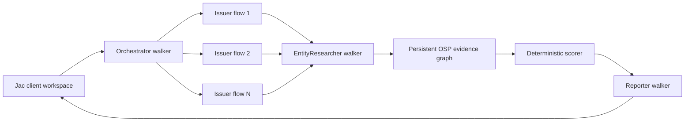

# Meridian

Meridian screens a bond watchlist for hidden credit risk before market open.
Under the hood, its Jac-native diligence workspace fans one research walker out
per issuer, stores every sourced claim in a persistent evidence graph, scores
only corroborated risk signals, and produces a ranked review.

The reliable demo needs no API keys. It ships with an illustrative eight-issuer
evidence snapshot so the complete research, concurrency, scoring, CSV,
persistence, and export workflow can be judged offline.

> Research prototype only. The seeded evidence is illustrative and is not
> investment advice.

## What works

- Real concurrent Jac flows for issuer research—eight workers complete near the
  slowest worker time rather than the sum of all worker times. The UI displays
  both measured values and the resulting speedup beside **Run diligence**.
- Persistent OSP graph: batch → issuers → attributes, signals, comparables, and
  generated report.
- Deterministic weighted risk score with a two-independent-signal flagging rule.
- Five source-bound evidence fields per seeded issuer, with citation URLs,
  excerpts, confidence, and capture time.
- Institutional data-room UI written in Jac: execution mesh, ranking table,
  evidence drawer, report view, search, reset, CSV ingestion, and exports.
- Capability-gated Tavily + OpenAI/byLLM live mode with seeded fallback.
- CSV validation for required names, duplicate identities, row limits, and file
  size.
- Automated unit/concurrency tests and a repository guard requiring more than
  50% Jac.

## Quick start

Python 3.12 is recommended.

```bash
git clone https://github.com/sathvik-gorle/meridian-jac.git
cd meridian-jac
python3.12 -m venv .venv
source .venv/bin/activate
pip install -r requirements.txt
jac install
jac start -d -p 8000 main.jac
```

Open [http://localhost:8000](http://localhost:8000). Click **Run diligence** to
execute the seeded mesh. The Jac API runs on port 8001 while development mode is
active.

## Demo path

1. Open the workspace; the persisted or newly seeded eight-issuer batch loads.
2. Click **Run diligence**. Jac launches one real flow per issuer and waits for
   the results before mutating the graph. Beside the button, compare measured
   parallel wall time with how long the same workers would take one-by-one.
3. Select a ranked issuer to inspect its five evidence records, source links,
   signals, score contributions, and comparable instruments.
4. Open **Report** to inspect or download the generated Markdown memorandum.
5. Export the current ranking as CSV.
6. Use **Upload entity CSV** with
   [`fixtures/sample_entities.csv`](fixtures/sample_entities.csv) to exercise
   validation and custom-batch persistence.

Custom issuers that do not match the seeded evidence set remain explicit partial
records in demo mode; live mode is intended for researching arbitrary names.

## Optional live mode

Copy the example environment file and add both keys:

```bash
cp .env.example .env
export OPENAI_API_KEY="..."
export TAVILY_API_KEY="..."
export BYLLM_DEFAULT_MODEL="openai/gpt-5.6-luna"
jac start -d -p 8000 main.jac
```

Meridian enables the live-mode control only when both credentials are present.
Tavily results are passed to typed byLLM extraction and classification
functions. A fact is accepted only when its evidence index resolves to one of
the supplied search results and its URL is HTTP(S); fewer than three accepted
facts causes a seeded fallback when one exists. Live calls are intentionally not
part of CI and should be tested with budget-limited credentials.

## Scoring

| Signal | Weight |
|---|---:|
| Credit rating changes | 25% |
| Borrowing cost vs peers | 25% |
| Legal exposure | 20% |
| Lender protections | 15% |
| Missing disclosures | 15% |

Each contribution is `weight × severity`, where severity is clamped to 0–1.
Meridian flags an issuer only when the score is at least 50 and at least two
independent signal categories are present.

## Architecture



The network-bound research happens concurrently in flows. Graph writes happen
through walkers after flow completion, keeping persistence deterministic and
avoiding shared-write races.

Core source:

- [`endpoints.sv.jac`](endpoints.sv.jac) — graph schema, live evidence adapter,
  scoring, persistence, flows, and walkers.
- [`frontend.cl.jac`](frontend.cl.jac) — the complete interactive client.
- [`main.jac`](main.jac) — full-stack entry point.
- [`test_meridian.jac`](test_meridian.jac) — fixture, scoring, corroboration, and
  concurrency tests.
- [`fixtures/demo_evidence.json`](fixtures/demo_evidence.json) — frozen,
  illustrative no-key demo evidence.
